

 

 

  
  
  
  
  
  
  
  
  
  
   

# Finaxis - Secure Banking App for Android and iOS

Finaxis is a cutting-edge banking application designed for both Android and iOS platforms, offering a seamless and secure way to manage your finances. Whether you're transferring funds, managing accounts, or tracking your transaction history, Finaxis provides an intuitive and efficient banking experience tailored to meet the needs of modern users.

## Goal 👀
The primary goal of the Finaxis project is to enhance my skills by practicing and exploring new technologies. Specifically:

- Compose Multiplatform: To gain hands-on experience with Jetpack Compose Multiplatform, enabling the creation of a unified user interface across Android and iOS platforms.
- Backend Development with Spring Boot: To practice building a custom backend using Spring Boot, providing a robust and scalable server-side solution rather than relying on external APIs.
This project serves as a learning opportunity to deepen my understanding of cross-platform development and backend engineering.

## Project Structure and Design Principles 🛠
**Finaxis** is built following the principles of Clean Architecture, which provides a clear separation of concerns and organizes the code into layers. The architecture is designed to make the app easy to extend and maintain.

**Finaxis** is structured into three main layers:

- **Presentation Layer:** Handles the UI using Jetpack Compose Multiplatform. Dependency injection (DI) is set up to manage UI components and state.
  
- **Domain Layer:** Contains the core business logic, including entities and use cases. It is independent of other layers, ensuring easy testability and adherence to **SOLID principles**.

- **Data Layer:** Manages data sources, including API services and local storage. DI is used to provide repository implementations that interact with the domain layer.

This architecture ensures a clean separation of concerns, making the project maintainable, scalable, and testable.

## 📸 Screenshots For IOS

|   |   |   |
|---|---|---|
|  | 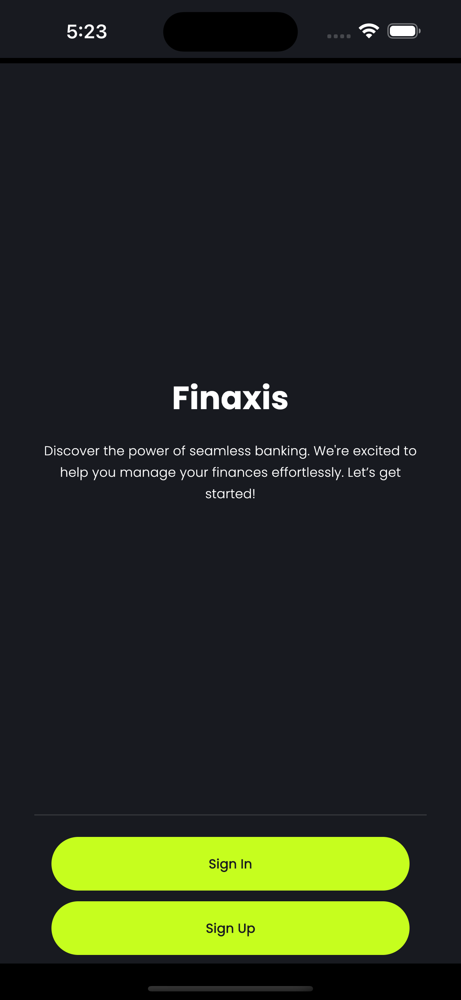 | 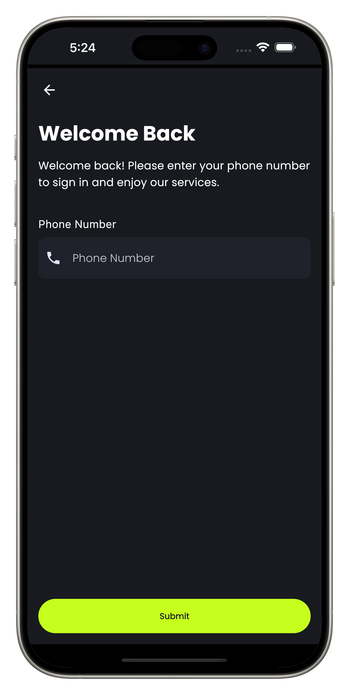 |
| 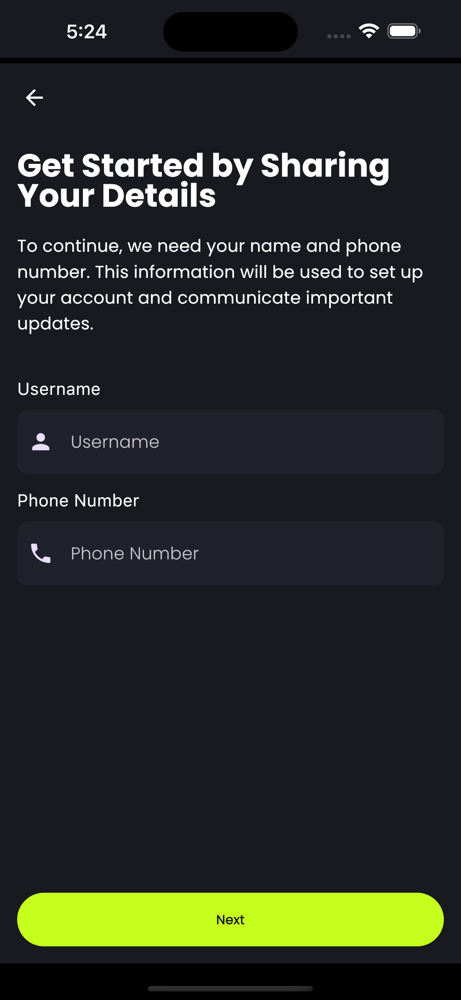 | 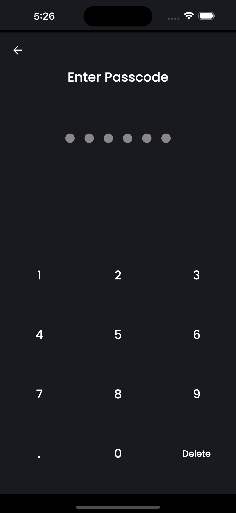 | 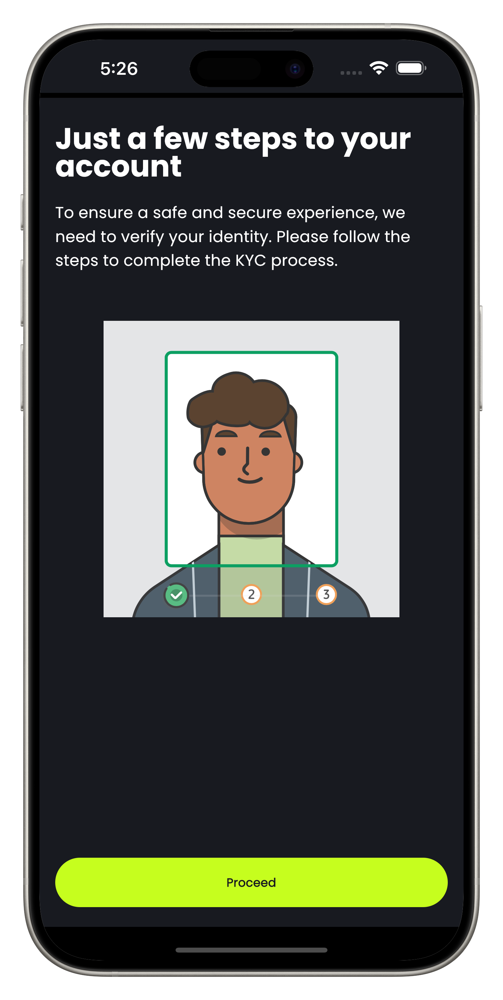 |
| 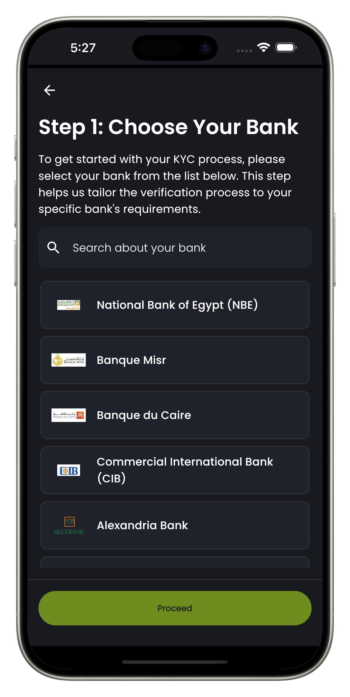 |  | 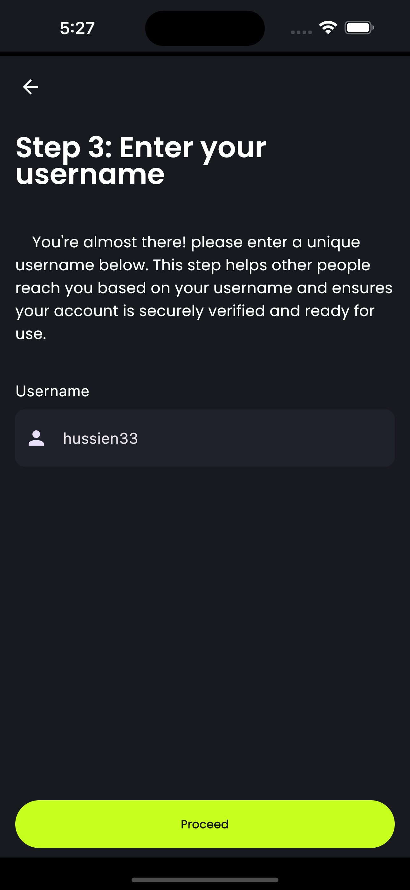 |
| 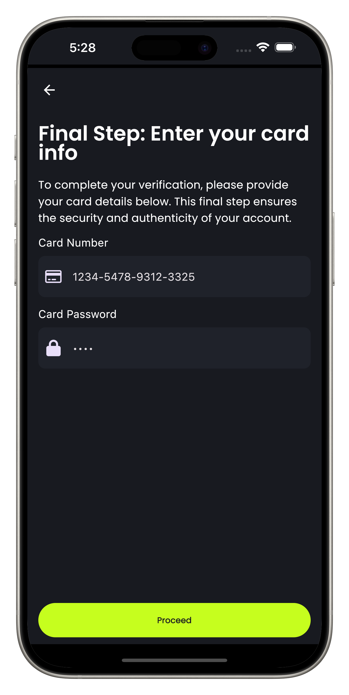 | 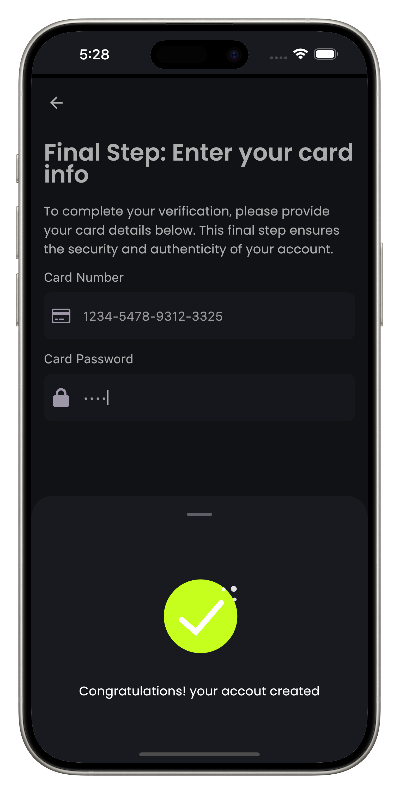 | 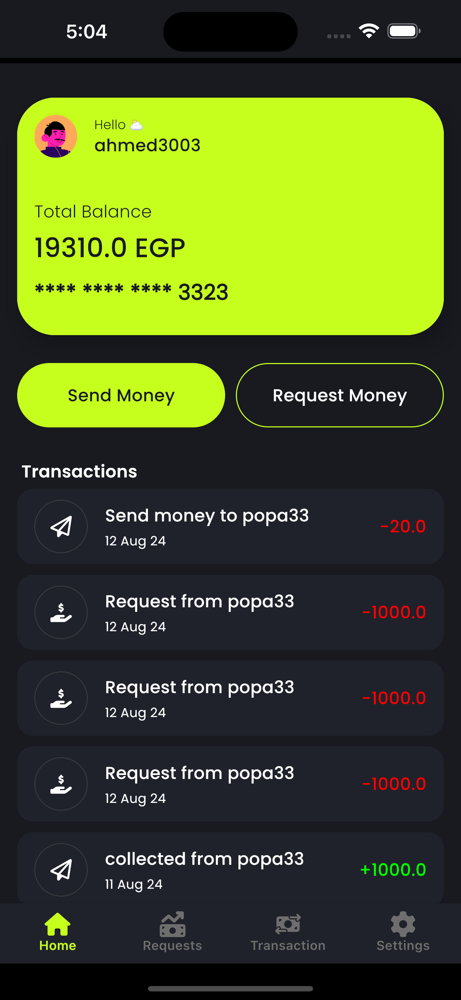 |
| 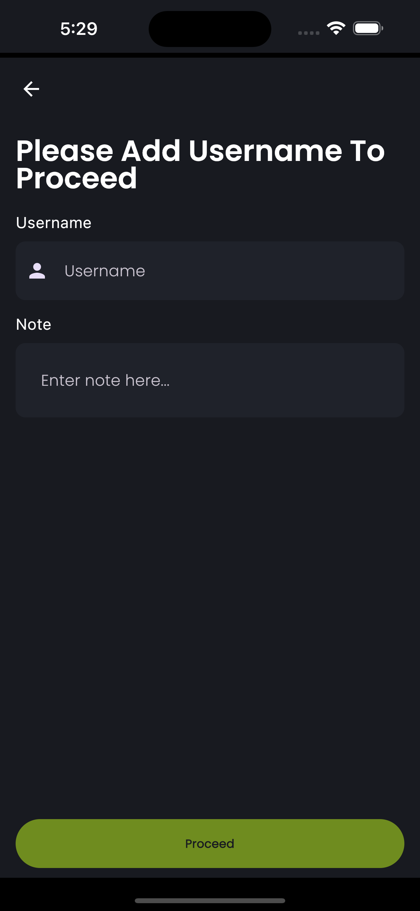 |  | 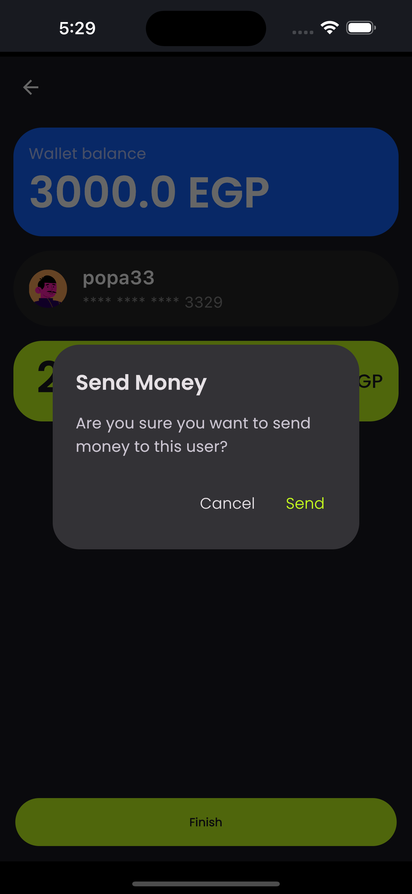 |
| 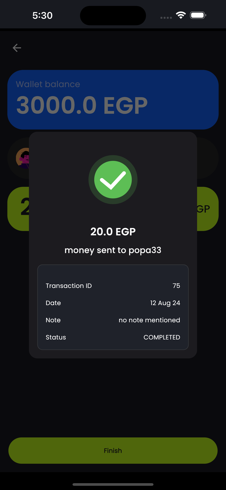 |  | 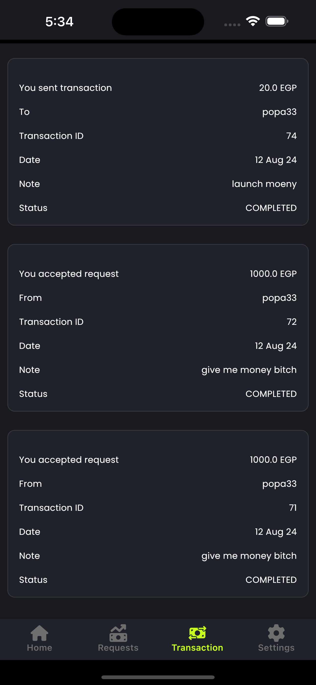 |
| 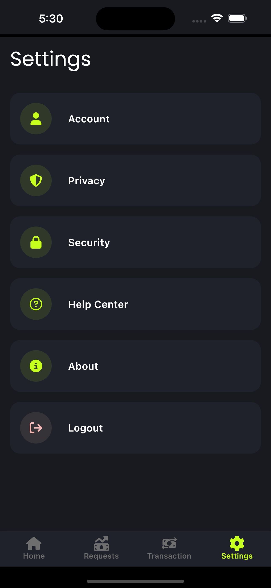 |

