<div align="center">
</br>

</div>

</br>
<p align="center">
  
  
  <a href="https://kotlinlang.org">
      
  </a>
  
  <a href="https://github.com/HossamSadekk/Finaxis/stargazers">
      
  </a>
  
  <a href="https://hits.sh/github.com/HossamSadekk/Finaxis/">
      
  </a>
  
  
  
  </br>
</p>

# Finaxis - Secure Banking App for Android and iOS

Finaxis is a cutting-edge banking application designed for both Android and iOS platforms, offering a seamless and secure way to manage your finances. Whether you're transferring funds, managing accounts, or tracking your transaction history, Finaxis provides an intuitive and efficient banking experience tailored to meet the needs of modern users.

## Goal 👀
The primary goal of the Finaxis project is to enhance my skills by practicing and exploring new technologies. Specifically:

- Compose Multiplatform: To gain hands-on experience with Jetpack Compose Multiplatform, enabling the creation of a unified user interface across Android and iOS platforms.
- Backend Development with Spring Boot: To practice building a custom backend using Spring Boot, providing a robust and scalable server-side solution rather than relying on external APIs.
This project serves as a learning opportunity to deepen my understanding of cross-platform development and backend engineering.

## Project Structure and Design Principles 🛠
**Finaxis** is built following the principles of Clean Architecture, which provides a clear separation of concerns and organizes the code into layers. The architecture is designed to make the app easy to extend and maintain.

**Finaxis** is structured into three main layers:

- **Presentation Layer:** Handles the UI using Jetpack Compose Multiplatform. Dependency injection (DI) is set up to manage UI components and state.
  
- **Domain Layer:** Contains the core business logic, including entities and use cases. It is independent of other layers, ensuring easy testability and adherence to **SOLID principles**.

- **Data Layer:** Manages data sources, including API services and local storage. DI is used to provide repository implementations that interact with the domain layer.

This architecture ensures a clean separation of concerns, making the project maintainable, scalable, and testable.

## 📸 Screenshots For IOS

|   |   |   |
|---|---|---|
| 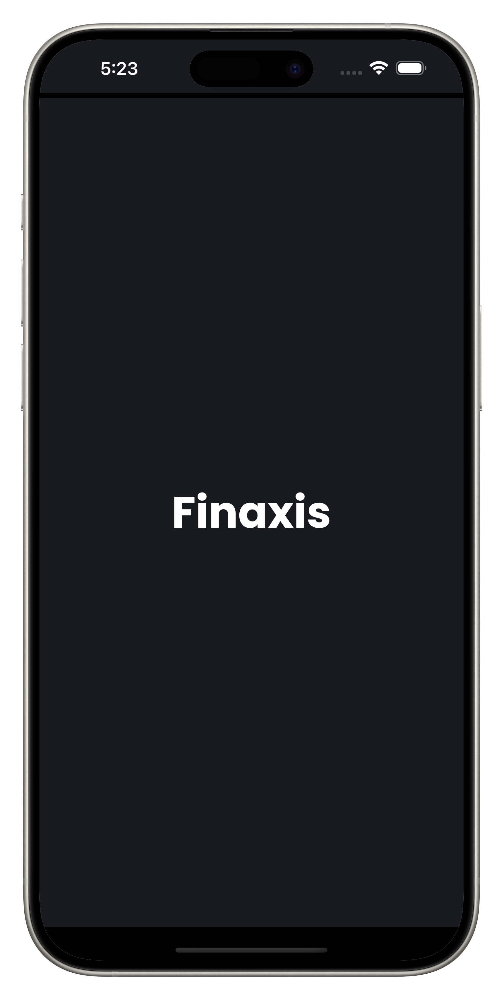 | 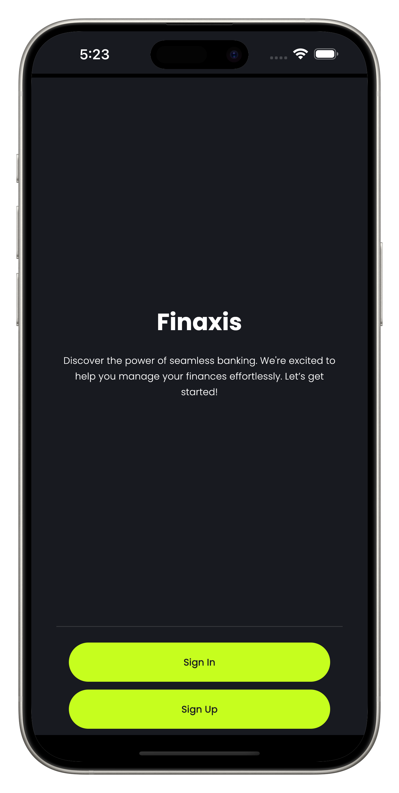 |  |
| 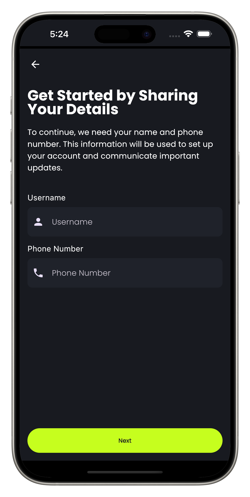 | 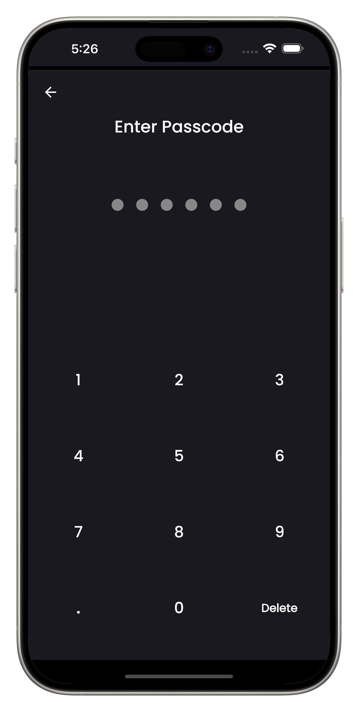 |  |
|  | 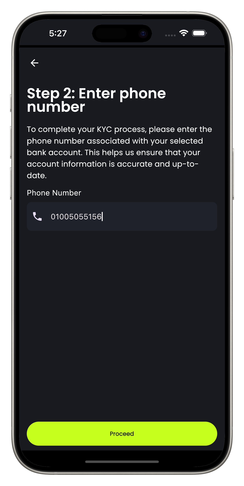 | 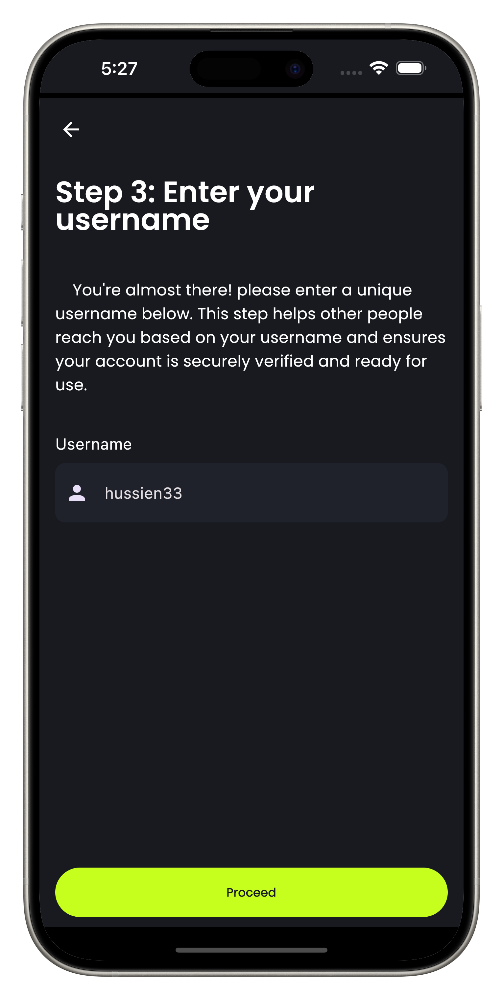 |
|  |  | 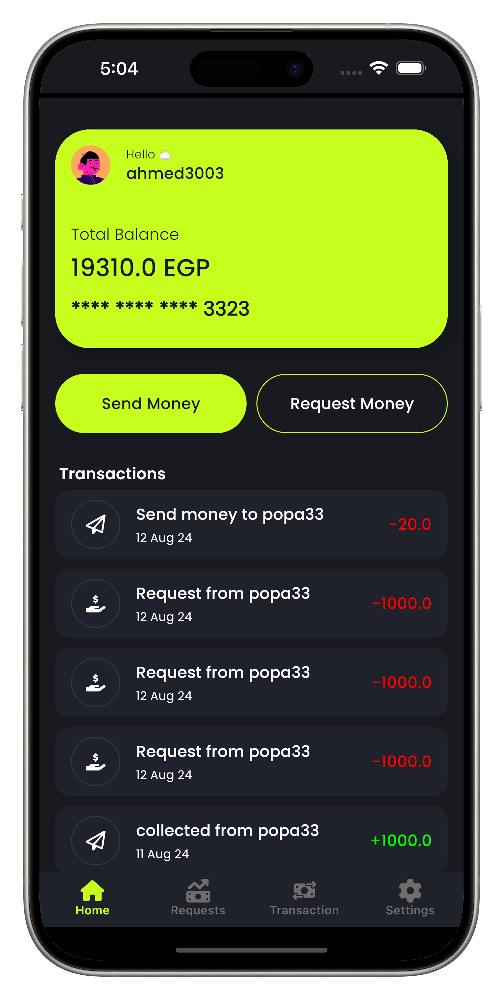 |
| 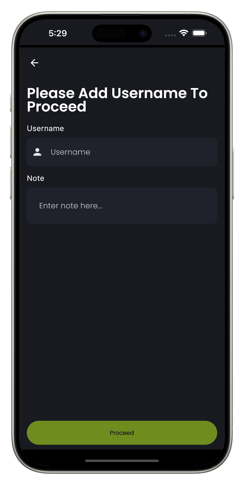 | 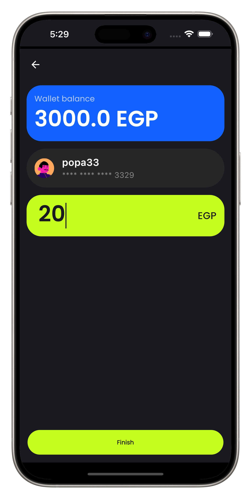 | 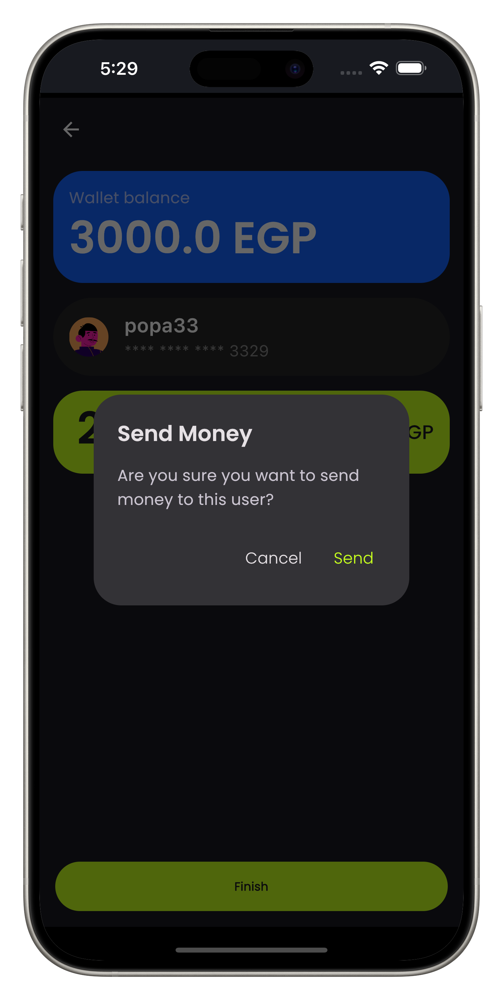 |
| 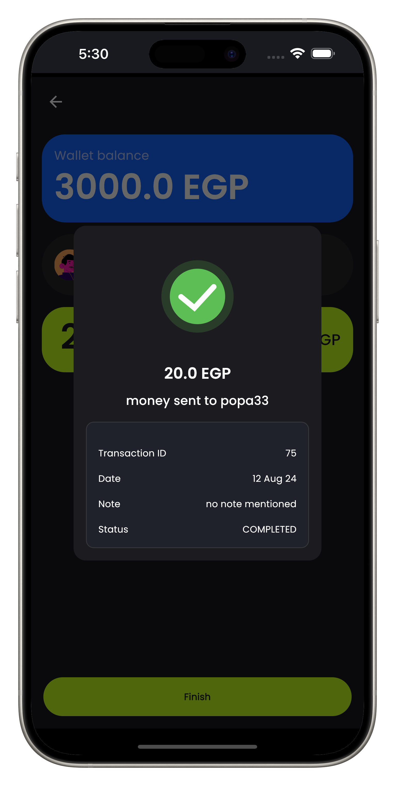 | 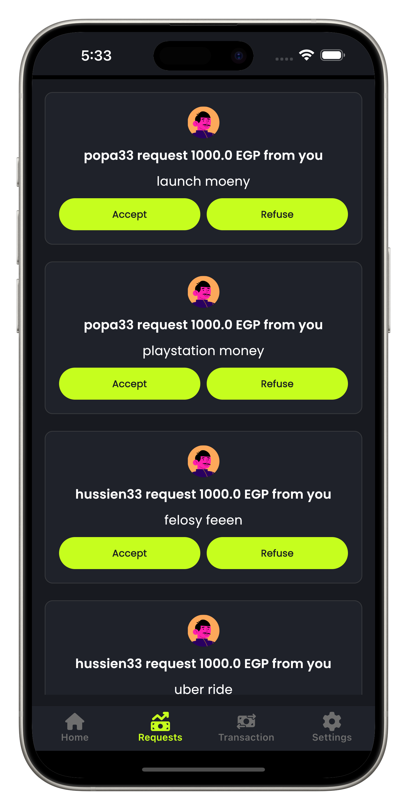 |  |
| 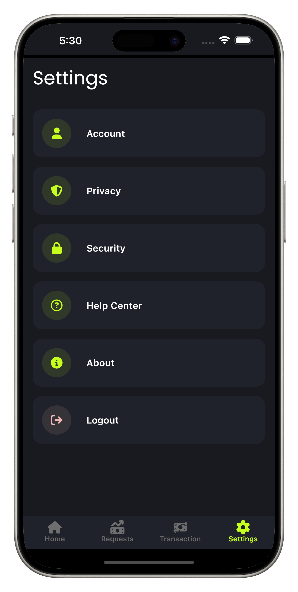 |

## 📸 Screenshots For Android

|   |   |   |
|---|---|---|
|  |  |  |
|  | 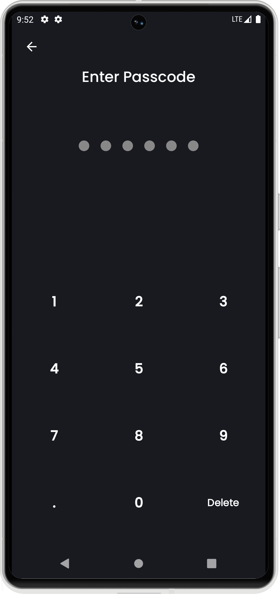 |  |
|  |  |  |
|  |  |  |
| 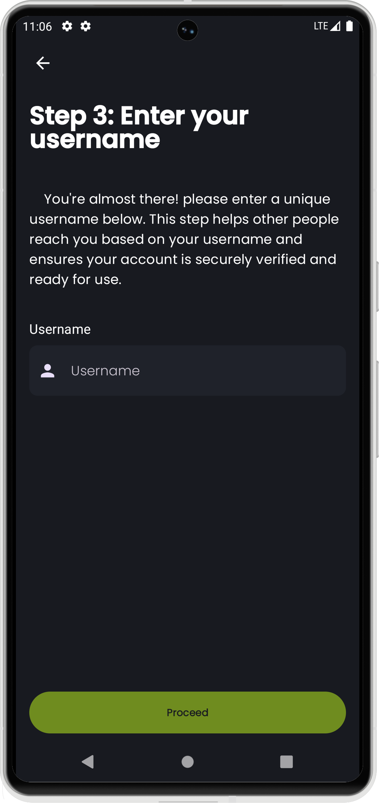 |  | 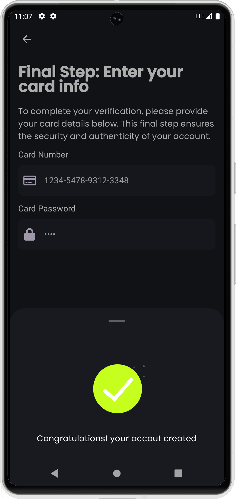 |
|  |  |  |
|  |  |  |

## 🚀 Future Plans

In the coming updates, we plan to enhance the project with the following features:

1.**Enhanced User Experience:** Improving the overall user interface and experience based on feedback to make the app more intuitive and user-friendly.

2.**New Features:** Adding new functionalities such as Donating Service, paying bills to increase the app's capabilities.

3.**Setting Screen:** Implementing settings screen flow.

4.**Security Enhancements:** Strengthening security measures to ensure user data is protected and to comply with the latest security standards.

5.**Bug Fixes and Updates:** Continuously addressing reported issues and releasing updates to fix bugs and introduce improvements.

# Built with 🛠
- [Kotlin](https://kotlinlang.org/) - First class and official programming language for Android development.
- [Compose](https://www.google.com/search?client=safari&rls=en&q=jetback+compose&ie=UTF-8&oe=UTF-8) - Modern UI toolkit for building native Android interfaces, offering a declarative approach to creating UIs with Kotlin.
- [Koin](https://insert-koin.io/docs/reference/koin-compose/multiplatform/) - Lightweight dependency injection framework for Kotlin, designed to simplify the setup and management of dependencies in applications with minimal boilerplate.
- [Ktor](https://ktor.io) - Asynchronous framework for building web applications and microservices in Kotlin, providing a flexible and scalable solution for server-side development, HTTP client functionality, and networking tasks.
- [Data Store](https://developer.android.com/topic/libraries/architecture/datastore) - A modern data storage solution for Android that provides a simple and efficient way to handle key-value pairs and typed objects, replacing SharedPreferences with improved performance and ease of use.
- [compose-imageloader](https://github.com/qdsfdhvh/compose-imageloader) - A lightweight and efficient image loading library for Android that simplifies the process of loading and displaying images, with support for caching, transformations, and image resource management.
- [Pull To Refresh](https://github.com/MateriiApps/pullrefresh) - A library for implementing pull-to-refresh functionality in Android applications, allowing users to refresh content by pulling down on a list or scrollable view.
- [Naiper](https://github.com/AAkira/Napier) -  A lightweight logging library for Kotlin Multiplatform projects, designed to provide a flexible and easy-to-use logging mechanism with support for different logging levels and customizable log formatting.
- [Kotlin](https://kotlinlang.org/) - First class and official programming language for Android development.

# Project Setup 📝
1. **Clone the Repository**
   
   Clone this repository to your local machine using the following command:
   ```bash
   git clone https://github.com/HossamSadekk/Finaxis

2. **Spring Boot**
   Setup the backend for spring boot side
   
3. **Required prerequisites**
   - Android Studio or Compatible IDE
   - Kotlin
   - Java IDE for spring
   - Xcode (For iOS Development)
   - Java Development Kit (JDK)
   - Additional Tools like 


